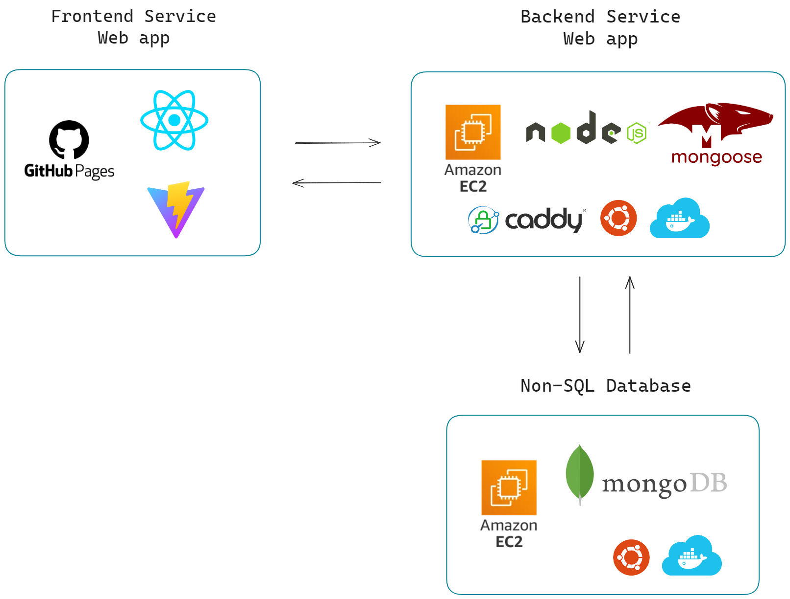

# Craft Your Own Crochet Palette 
##### A website for crochet creators to design color patterns for crochet pieces.

##### [Take a 30-second peek at Instagram Reels](https://www.instagram.com/reel/C6hBS7hPK5p/)

This webpage is tailored for crochet enthusiasts to store their personalized color palettes.  

Users can apply these palettes directly to crochet patterns, offering a clearer visualization of how selected color combinations will appear on their products. 

By automating color blending and providing inspiration for combinations, this tool saves creators time and sparks new ideas for stunning color schemes. 

Frontend website: https://teienbiyori.github.io/Your-Own-Crochet-Palette/

Read more details... [Click Here](https://github.com/teienbiyori/Your-Own-Crochet-Palette/)

### System Architecture Diagram

 

### API Docs(via Postman):

[Fontend APIs](./public/前台.postman_collection.json)

[Backend APIs](./public/後台.postman_collection.json)

### Dependencies
- bcryptjs: "^2.4.3"
- cors: "^2.8.5"
- dotenv: "^16.4.5"
- express: "^4.19.2"
- mongoose: "^8.2.3"
- passport: "^0.7.0"
- passport-jwt: "^4.0.1"

### Roadmap
Our roadmap includes the following upcoming features:
1. **Yarn Supplier Palette Form**
   - Implement a form page that allows yarn suppliers to showcase their color palettes by adding the specific colors they offer. This feature will enable suppliers to reach more crocheters and knitters by showcasing the range of yarn colors available. 
2. **Palette Reordering** (Feature updated and completed as of April 2024)
   - Implement a functional button to reorder colors in the palette based on ascending hexcode values. This upcoming feature will simplify navigation and help users quickly locate specific colors within the palette. It enhances usability and aesthetics by organizing colors in a more structured and visually appealing manner.
3. **Display Brand Name on Color Hover**
   - Improve the user experience by displaying the brand name of each color when the mouse hovers over it in the palette. Knowing the brand name will enable users to easily locate and purchase the specific yarn needed to bring their project designs to life.

### Contributors
##### Front-End & UI/UX - [@teienbiyori](https://github.com/teienbiyori)
##### Back-End - **Tommy0901**

